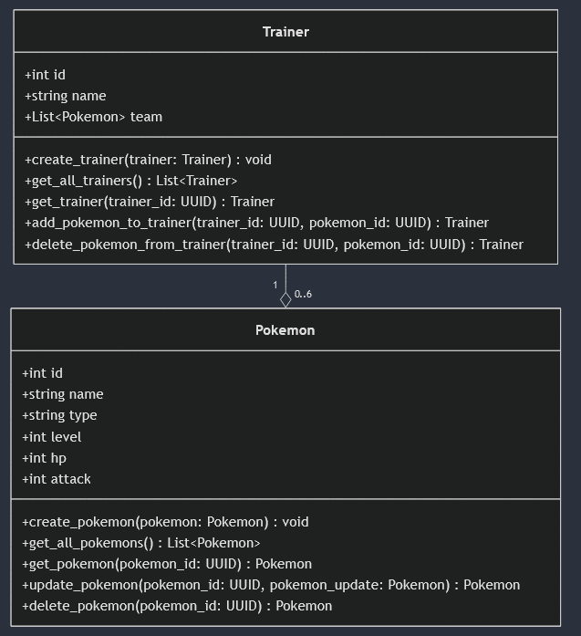

# FastAPI Pokémon Trainer Management API

## Opis projektu

Ten projekt to API stworzone za pomocą frameworka **FastAPI**, które umożliwia zarządzanie trenerami Pokémonów oraz ich Pokémonami. Aplikacja wspiera operacje CRUD (Create, Read, Update, Delete) na danych Pokémonów i trenerów oraz dodawanie i usuwanie Pokémonów z drużyn trenerów.

## Funkcjonalności

- Zarządzanie Pokémonami:
  - Dodawanie nowych Pokémonów.
  - Pobieranie listy wszystkich Pokémonów.
  - Pobieranie szczegółowych informacji o wybranym Pokémonie.
  - Aktualizacja informacji o Pokémonie.
  - Usuwanie Pokémonów.
  
- Zarządzanie trenerami:
  - Dodawanie nowych trenerów.
  - Pobieranie listy wszystkich trenerów.
  - Pobieranie szczegółowych informacji o wybranym trenerze.
  - Dodawanie Pokémonów do drużyn trenerów (maksymalnie 6 Pokémonów).
  - Usuwanie Pokémonów z drużyn trenerów.

## Wymagania

- Python 3.9+
- FastAPI
- Uvicorn (do uruchamiania serwera)

## Instalacja

1. Sklonuj repozytorium projektu:
   ```bash
   git clone <URL>
   cd <nazwa-repozytorium>
   ```

2. Utwórz i aktywuj wirtualne środowisko:
   ```bash
   python -m venv venv
   source venv/bin/activate # Linux/macOS
   venv\Scripts\activate # Windows
   ```

3. Zainstaluj wymagane pakiety:
   ```bash
   pip install fastapi uvicorn
   ```

## Uruchamianie aplikacji

1. W terminalu uruchom serwer FastAPI za pomocą Uvicorn:
   ```bash
   uvicorn main:app --reload
   ```

2. Otwórz przeglądarkę i przejdź do interfejsu dokumentacji Swagger:
   - [http://127.0.0.1:8000/docs](http://127.0.0.1:8000/docs)

## Endpointy

### Pokémon

- **POST `/pokemons/`**  
  Tworzenie nowego Pokémona.

- **GET `/pokemons/`**  
  Pobranie listy wszystkich Pokémonów.

- **GET `/pokemons/{pokemon_id}`**  
  Pobranie szczegółowych informacji o Pokémonie na podstawie jego `id`.

- **PUT `/pokemons/{pokemon_id}`**  
  Aktualizacja informacji o Pokémonie na podstawie jego `id`.

- **DELETE `/pokemons/{pokemon_id}`**  
  Usuwanie Pokémona na podstawie jego `id`.

### Trenerzy

- **POST `/trainers/`**  
  Tworzenie nowego trenera.

- **GET `/trainers/`**  
  Pobranie listy wszystkich trenerów.

- **GET `/trainers/{trainer_id}`**  
  Pobranie szczegółowych informacji o trenerze na podstawie jego `id`.

- **POST `/trainers/{trainer_id}/add_pokemon/{pokemon_id}`**  
  Dodanie Pokémona do drużyny trenera.

- **DELETE `/trainers/{trainer_id}/remove_pokemon/{pokemon_id}`**  
  Usunięcie Pokémona z drużyny trenera.

## Przykład danych

### Pokémon

```json
{
  "name": "Pikachu",
  "type": "Electric",
  "level": 10,
  "hp": 35,
  "attack": 55
}
```

### Trener

```json
{
  "firstName": "Ash",
  "lastName": "Ketchum",
  "age": 10,
  "gender": "Male",
  "pokemonTeam": []
}
```

## Uwagi

- Każdy Pokémon w drużynie trenera musi być unikalny.
- Trenerzy mogą mieć maksymalnie 6 Pokémonów w swojej drużynie.

## Autorzy

Marceli Karman.

## Diagram UML


